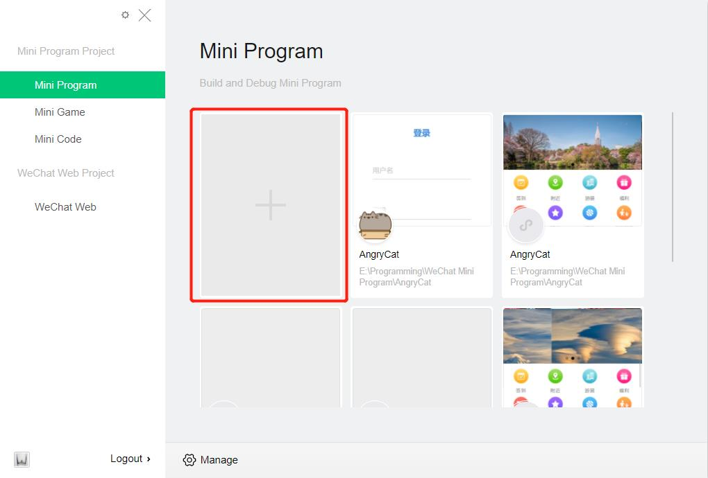
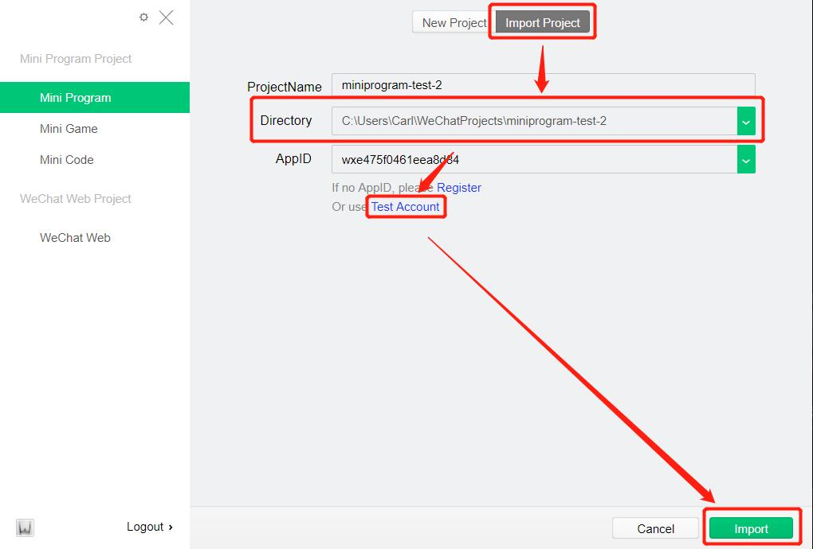
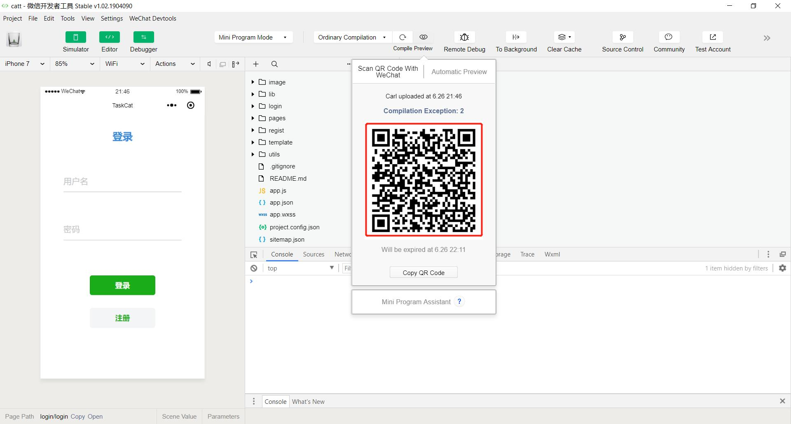

# 安装包与《安装部署说明》

## 安装包
由于本项目是基于微信小程序平台开发的Web应用，不需要通过安装包进行安装。然而，**由于小程序尚未完成微信的审核，在您检验软件成果的时候可能需要劳烦您联系本小组组长(姚同学:组队信息中的QQ号/yaojw7@mail2.sysu.edu.cn)，组长将会把您加入到小程序测试名单中，此后便能通过微信访问本程序。**

除此以外，您还可以下载本项目的源代码，通过微信开发者工具在手机上进行运行测试，具体的部署说明如后文。

## 安装部署说明

### 源代码
您可以在此[链接](https://github.com/2019swsad/AngryCat)下载项目的微信小程序源代码。

### 安装部署
- 打开[微信web开发者工具](https://developers.weixin.qq.com/miniprogram/dev/devtools/download.html)，并点击图中按钮
  
- 点击"Import Project"选项卡，选择项目代码包所在的文件夹，并点击下方的“Test Account”按钮，随后便可以点击“Import”按钮打开项目
  
- 打开项目后，点击"Preview"按钮，选择“Scan QR Code With WeChat”并用手机微信扫描下方二维码，在手机上对程序进行测试。**我们强烈建议您使用手机进行测试，微信开发者工具提供的模拟器并不稳定，时常出现莫名其妙的BUG**
  

## 常见问题
1. 在进行测试的过程中，**偶尔会出现“无法选中输入框”或“输入过程中失焦”的情况**。这是微信Web开发者工具的BUG，只需要多次点击输入框(点击时，请点击输入框上方位置以便选中)——**再次建议使用手机测试，不要用模拟器**

待补充...
