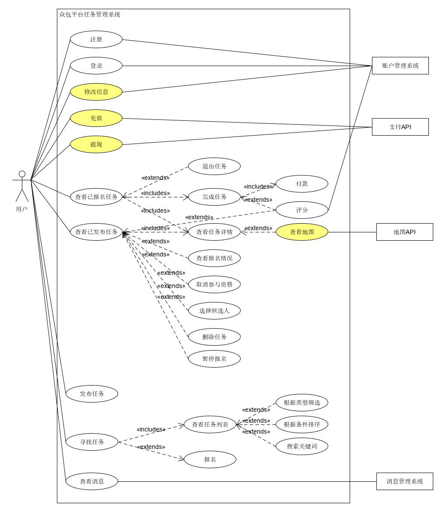
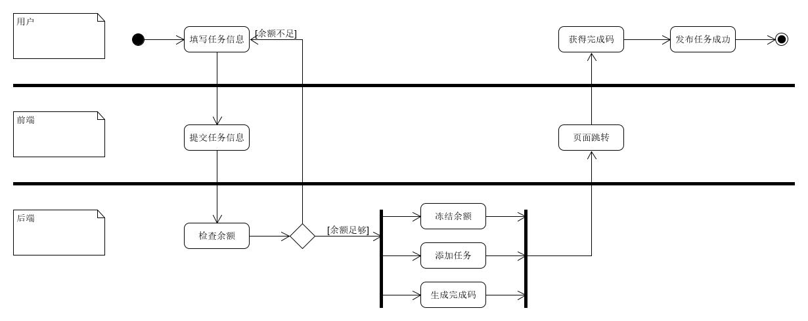
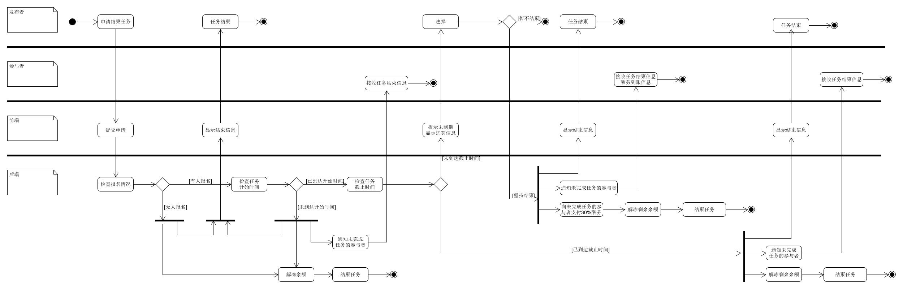
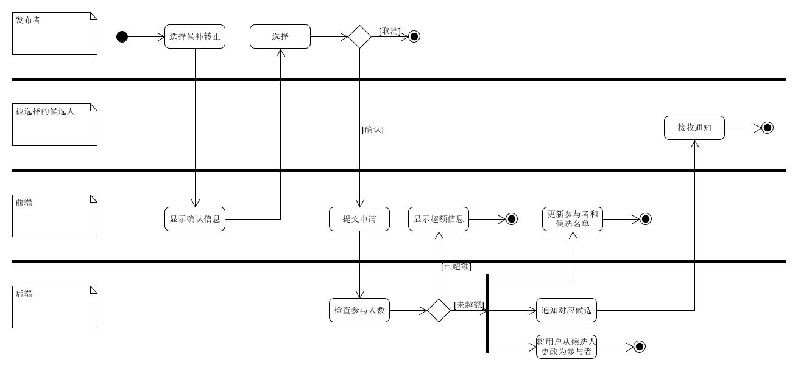

# 用例图


----


# 用例
**用例名称：** 发布与参与任务

**范围：** “赚快钱”众包平台

**级别：** 用户目标

**主要参与者：** 任务发布者与参与者

**涉众及其关注点：**
  - 任务发布者：希望能够发布任务，并能借助金钱的激励使需求得到快速响应，以快速地让需求得到满足。
  - 任务参与者：希望能利用闲暇时间，完成一些力所能及的工作，以获得满意的报酬。
  - 平台：希望能够借助良好的用户体验来吸引大量的用户进入平台，随后通过促成交易来收取一定比例的佣金，并可以利用用户特点、用户行为和历史交易等信息来实现精准地任务推荐，从而提高促成交易的效率。
  
**前置条件：**  注册的用户使用的均为真实信息

**成功保证(或后置条件)：** 任务发布；任务报名；更新任务状态；验证任务完成情况；完成结算

**主成功场景(或基本流程)：**

	1. 用户填写相关资料以注册账号；
	2. 用户使用账号、密码登录平台；
	3. 发布者通过填写任务信息(标题、任务类型、详细要求、时间、地点、人数、酬劳等)发布任务；
	4. 系统冻结发布者用作酬劳余额；
	5. 任务在成功发布后，系统会为发布者生成一个任务确认码；
	6. 用户通过搜索、推荐、排序等方式查找感兴趣的任务；
	7. 用户报名参加任务，并成为参与者；
	8. 发布者可查看报名者的基本信息和取消某些报名者的报名申请；
	9. 在报名者完成任务后，发布者向其提供任务确认码；
	10. 报名者在任务中输入确认码以完成任务并获取报酬；
	11. 任务完成后，发布者和参与者可进行相互评价；

**拓展(或替代流程)：**

	a. 当任务报名人数超额时：
		1. 报名者按时间顺序依次进入候补名单；
		2. 被选择的候补人员将会收到系统通知信息；
	b. 当任务有新的报名者时：
		1. 更新任务状态并通知发布者；
	c. 当任务状态改变时：
		1. 更新任务状态并通知参与者；
	d. 当参与资格被取消时：
		1. 参与者会收到系统通知信息；
		2. 更新任务信息；
	e. 当参与者需要退出任务时：
		1. 已到开始时间：
			1) 退出任务；
			2) 扣除参与者信誉值；；
			3) 通知发布者；
		2. 未到开始时间：
			1) 退出任务；
			2) 通知发布者；
	f. 当发布者需要停止报名时：
		1. 任务不再接受报名；
	g. 当发布者需要结束进行中的任务时：
		前置条件：任务已停止报名
		1. 任务未有人报名：
			1) 任务进入结束状态；
			2) 解冻发布者的余额；
		2. 任务已有人报名：
			1) 未到任务开始时间：
				a) 任务进入结束状态；
				b) 解冻发布者的余额；
				c) 通知未完成任务的参与者；
			2) 已到任务开始时间：
				a) 未到任务截止时间：
					I. 向未完成任务的参与者支付30%酬劳作为补偿；
					II. 任务进入结束状态；
					III. 解冻发布者的余额；
					IV. 通知仍未完成任务的参与者；
				b) 已到任务截止时间：
					I. 任务进入结束状态；
					II. 解冻发布者的余额；
					III. 通知仍未完成任务的参与者；
	h. 当发布者需要取消某个参与者的资格：
		前置条件：未到达任务开始时间；参与者未完成任务
		1. 从参与列表中移除相应用户；
		2. 通知被移除的用户；
	i. 当发布者需要转正候补人员：
		前置条件：参与者名额未满；
		1. 将相应用户移动至参与列表；
		2. 通知被转正用户；
	j. 当用户需要查看任务详情页时：
		1. 判断用户身份；
		2. 检测任务状态；
		3. 根据用户身份及任务状态返回详情页面；


# 活动图
以下为部分关键且较为复杂的流程的活动图，简单流程暂不提供对应活动图。

- 登录注册流程：


- 发布任务流程：


- 查看任务详情流程：


- 报名流程：


- 完成任务流程：


- 结束任务流程：


- 取消报名资格流程：


- 选择候补流程


- 退出任务流程


----

# 领域模型


-----

# 状态模型
在本项目中，存在着“任务状态机”和“订单状态机”，两种状态机分别对应“发布者视角”和“报名者视角”。我们可以将众包平台的发布任务与接受任务与电商平台类比——发布者比作卖家，报名者比作买家。进而，“任务状态机”可视作“商品的状态机”，“订单状态”可视作“购物订单的状态机”。
## 任务状态机
任务状态机是由任务发布者控制的，由3种主要状态和其他次要状态组成，主要状态有：
 - 任务报名中
 - 任务进行中
 - 任务已结束
 
完整的状态模型如下：


## 订单状态机
订单状态机是由报名者控制的，并会受到任务状态机影响。由5种主要状态和其他次要状态组成，主要状态有：
- 订单进行中
- 候补中
- 订单已完成
- 订单已关闭
- 订单已失效
- 订单已评价

完整的状态模型如下：


------

# 功能模型
## 注册登录
- 注册：
  - 注册时，前端循环检查内容输入格式是否正确；
  - 用户提交注册信息后，后端检查用户名是否已存在：
    - 若不存在，则在数据库添加新用户信息，并返回“注册成功”信息；
    - 若已存在，则返回“用户已存在”信息；


- 登录
  - 用户在前端输入登录信息；
  - 前端向后端提交信息，后端对信息进行验证；
  - 循环该过程直至信息验证成功；
  - 前端跳转至主页面；


## 一般业务
- 修改个人信息：
  - 用户向前端提交需要修改的信息；
  - 后端完成信息的更新；
  - 前端更新页面，以显示新的信息；


- 发布任务：
  - 用户在前端输入任务发布信息；
  - 前端向后端提交信息；
  - 后端计算发布者的余额是否充足：
    - a. 若余额不足：
    - a1. 返回“余额不足”信息；
    - b. 若余额充足：
    - b1. 冻结用户用于酬劳的余额；
    - b2. 在后端添加任务信息；
    - b3. 返回“发布成功”信息；


- 报名
  - 用户向前端发送报名申请；
  - 前端向后端转发报名申请；
  - 后端检查任务的当前报名人数：
    - 若报名人数未超额，则将用户加入报名列表中；
    - 若报名人数超额，则将用户加入候补列表中；
    - 返回报名情况信息；


- 查找任务：
  - 用户向前端提交“查询任务”请求，并可选排序、分类、关键词检索功能；
  - 前端向后端请求符合关键词和分类的任务列表；
  - 前端对返回的任务列表进行排序；


- 获取任务详情
  - 用户向前端发送“获取任务详情”的请求；
  - 前端将被请求任务的tid及用户的uid发送给后端；
  - 后端向前端返回相应任务详情，并返回用户与任务的关系；
  - 前端根据用户与任务的关系，提供不同的“任务详情”页面（不同角色有不同操作权限）


- 查看消息
  - 用户向前端发送“查看消息”请求；
  - 前端向后端转发请求；
  - 后端返回相应用户的所有通知消息；


## 任务管理
- 删除任务：
  - 发布者向前端发送删除任务请求；
  - 前端将请求转发至后端；
  - 后端检查用户删除任务的频次：
    - a. 若频次没有超过阈值：
    - a1. 解冻发布者的酬劳余额；
    - a2. 删除任务信息；
    - b. 若频次超过阈值：
    - b1. 降低发布者的信誉值；
    - b2. 解冻发布者的酬劳余额；
    - b3. 删除任务信息；
    - b4. 返回“降低信誉值”信息；
    - 返回“删除成功”信息;
    - 后端通知参与者“删除任务”信息


- 退出任务：
  - 参与者向前端发送退出任务请求；
  - 前端将请求转发至后端；
  - 后端检查任务状态：
    - a. 若任务处于“报名状态”；
    - a1. 将参与者从报名名单中移除；
    - b. 若任务处于“进行状态”；
    - b1. 降低参与者的信誉值；
    - b2. 将参与者从报名名单中移除；
    - b3. 返回“降低信誉值”信息；
    - 返回“退出成功”信息
    - 后端通知发布者“退出任务”信息


- 查看报名情况：
  - 发布者向前端发送“查看报名情况”请求；
  - 前端向后端转发请求；
  - 后端返回报名列表与候补列表；

 
- 取消报名资格：
  - 发布者向前端发送取消某位报名者的报名资格请求；
  - 前端向后端提交信息；
  - 后端将相应报名者从报名列表中移除；
  - 后端向前端返回“取消成功”信息；
  - 前端向后端重新请求报名列表；
  - 后端返回报名列表，前端更新页面；
  - 返回“取消成功”信息；
  - 后端通知参与者“取消报名资格”信息；


- 选择候补人员：
  - 发布者向前端发送选择特定候补人员的请求；
  - 前端向后端转发请求；
  - 后端检查报名者数量是否超额：
    - a. 若未超额：
    - a1. 将特定人员从候补名单移至报名名单；
    - a2. 返回成功信息；
    - a3. 前端向后端请求报名列表；
    - a4. 后端返回结果，前端更新页面
    - a5. 后端通知候补人员转正信息；
    - b. 若超额：
    - b1. 返回操作失败信息；


- 开始任务
  - 发布者向前端发送开始任务的请求；
  - 前端向后端转发请求；
  - 后端检查任务报名人数：
    - a. 若报名人数不为0：
    - a1. 后端将任务设置为开始状态；
    - a2. 后端生成任务完成码；
    - a3. 后端返回开始信息与完成码；
    - a4. 后端通知参与者任务已开始；
    - b. 若报名人数为0：
    - b1. 返回“人数不足”信息；


- 完成任务
  - 参与者在前端输入完成码，申请完成任务；
  - 前端向后端转发请求；
  - 后端验证完成码：
    - a. 若完成码正确：
    - a1. 将参与者状态改为“完成”；
    - a2. 从冻结的酬劳中向参与者发起支付；
    - a3. 返回完成与支付信息；
    - a4. 后端向发布者返回完成与支付信息；
    - b. 若完成码错误：
    - b1. 返回“完成码错误”信息；


----

# 补充需求

## 修订历史
|版本|日期|描述|作者|
|:--:|:--:|:--:|:--:|
|初始草案|2019年6月24日|第一个草案，主要在细化阶段中对需求进行精细化|苏泽华|

## 简介
本文档记录了项目中所有未在用例中描述的需求

## 功能性

1. **日志**

  项目的后端需要维护日志，用于记录所有请求与数据库操作。以便出现非法请求、数据丢失、系统崩溃时查阅和恢复。
  
2. **错误处理**

  后端会检验请求的合法性，当收到非法请求时可以进行拦截并返回错误信息。
  
3. **安全问题**

  除了登录和注册功能以外，后端会对请求发起者进行身份验证。如果发起请求的用户身份非法，会拦截请求并返回错误信息。
  
4. **任务中心检索**

  为避免冲突，用户无法在任务中心检索到自己发布的任务。
  
5. **推荐任务**

  - 为避免冲突，推荐任务中不会出现用户自己发布的任务。
  - 根据用户完成的任务的标签，精准地向用户推荐任务。

## 可用性

  1. **错误提示**
  
  当用户的操作非法时(如：账号密码错误、余额不足等)，后端能识别并返回提示信息，前端将向用户发起相关提示。
    
  2. **实时监测用户名是否已存在**
  
  在注册的过程中，当用户输入的“用户名”已存在时，会即时向用户提供反馈，帮助用户找到还未被注册的用户名。
  

## 可靠性
  1. **可恢复性**
  
  - 如果在使用外部服务(如微信支付等)时出现错误，为了完成充值/提现，需要尝试采用本地方案(如存储和转发)加以解决。
  - 数据库应该周期性地进行冗余备份，当数据丢失时可以及时恢复。
  
  2. **性能**
  
  - 为减少请求数据的次数、加快响应速度，我们应该将部分需要频繁请求的数据进行本地化存储。
  - 为减少用户的等待时间，我们需要使用带宽更大的的服务器。


## 可支持性
  1. **可适应性**
  
    系统需要可以同时支持安卓和IOS设备，且对于屏幕尺寸不同的手机有较好的视图适配。
    
  2. **任务类型**
  
    对于非调问卷任务，我们为参与者和发布则之间的联系提供支持。
    
## 实现约束
  - **客户端**
  
  本项目的客户端选用微信小程序——一种基于微信的服务形式，比起Web应用更加接近原生态，而且用户省去安装App的时间，提高用户体验。除此以外，微信小程序还可以同时对安卓设备和IOS设备进行支持，而不需要分别开发两种系统的客户端，缩短开发周期。
  
  - **服务端**
  
  本项目的服务端使用Node.js作为编程语言，Koa2作为Web框架，从而在保证高性能的前提下，缩短开发周期。
  
  - **数据库**
  
  本项目的数据库使用自建的MongoDB，而没有选用微信提供的数据库服务。这样做是为了保证系统的灵活度、可维护性和可拓展性。
  
## 购买构件
  为了满足项目部署的需要和微信调用外部数据库的需要，我们购买了以下构件
  - 服务器
  - 域名

## 免费开源构建
  - MongoDB数据库

# 接口
  - 微信支付接口
  - 手机号验证接口
  - 推广信息接口
  
# 法律问题
  我们建议使用一些开源构件，但是要解决其许可限制的问题，以便使包含开源软件的产品能够转售。
  
  除此以外，作为一个开放的众包平台，我们要求用户承担以下的义务和责任：

```sh

1、用户应独立地对用户资料和发布内容承担责任，并承诺遵守中华人民共和国法律法规和公序良俗，不得制作、复制、发布、传播以下信息：
  （1）反对宪法所确定的基本原则的；
  （2） 危害国家安全，泄露国家秘密，颠覆国家政权，破坏国家统一的；
  （3） 损害国家荣誉和利益的；
  （4） 煽动民族仇恨、民族歧视，破坏民族团结的；
  （5）破坏国家宗教政策，宣扬邪教和封建迷信的；
  （6）散布谣言，扰乱社会秩序，破坏社会稳定的；
  （7）散布淫秽、色情、赌博、暴力、凶杀、恐怖或者教唆犯罪的；
  （8）侮辱或者诽谤他人，侵害他人合法权益的；
  （9）侵犯第三者权益的；
  （10）以非法民间组织名义活动的；
  （11）含有法律、行政法规禁止的其他内容的。
2、遵守其他有关国家和地区的法律规定以及国际法的有关规定。
3、不利用我方服务从事以下活动：
  （1）未经允许，进入计算机信息网络或者使用计算机信息网络资源的；
  （2）未经允许，对计算机信息网络功能进行删除、修改或者增加的；
  （3）未经允许，对进入计算机信息网络中存储、处理或者传输的数据和应用程序进行删除、修改或者增加的；
4、不以任何方式干扰我方的服务和系统；
5、遵守我方所有其他规定和程序；
6、不得以任何连锁信件、滥发电子邮件或任何不当的方式发布信息；
7、未经相关人士同意，收集或不当使用其他人士的电子邮件地址及其他个人资料；
8、制作虚假的电子邮件地址，或以其他形式试图在信息发送人的身份或来源方面误导他人；
9、用户理解并明确授权，如果我方认为用户发布的信息明显属于上述所列内容之一，我方有权立即停止向该用户提供服务，删除该用户发布的非法信息，并保存有关记录向国家有关机关报告；
10、用户须对自己在使用我方服务过程中的行为承担法律责任。用户承担法律责任的形式包括但不限于对受到侵害的第三方进行赔偿，并承担相应的其他法律责任。如用户违反本条规定造成我方被第三人索赔的，用户应全额补偿我方一切费用（包括但不限于各种赔偿费、诉讼代理费及为此支出的其它合理费用）。
```
